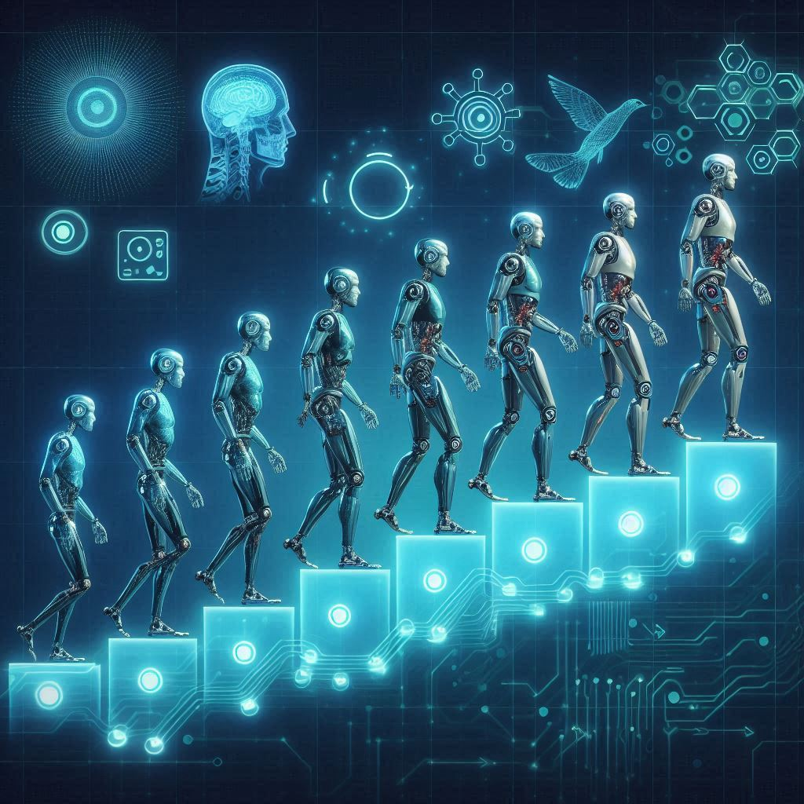

## 📒 Descrição
Desafio de projeto da DIO no Bootcamp - CAIXA IA Generativa com Microsoft Copilot: Criando um Podcast com IAs Generativas.

## 🤖 Tecnologias Utilizadas
- ChatGPT
- Clipchamp
- Copilot

## 🧐 Processo de Criação
O projeto foi criado seguindo as orientações de Felipe, Tech Educator da DIO.
- Roteiro gerado por meio do ChatGPT
- Audio gerado pelo Clipchamp
- Copilot para gerar imagem

## 🚀 Resultados
[Audio Podcast](https://github.com/Cris-Pin-Bel/Criando_Podcast/blob/main/Audio_Podcast.mp4)

